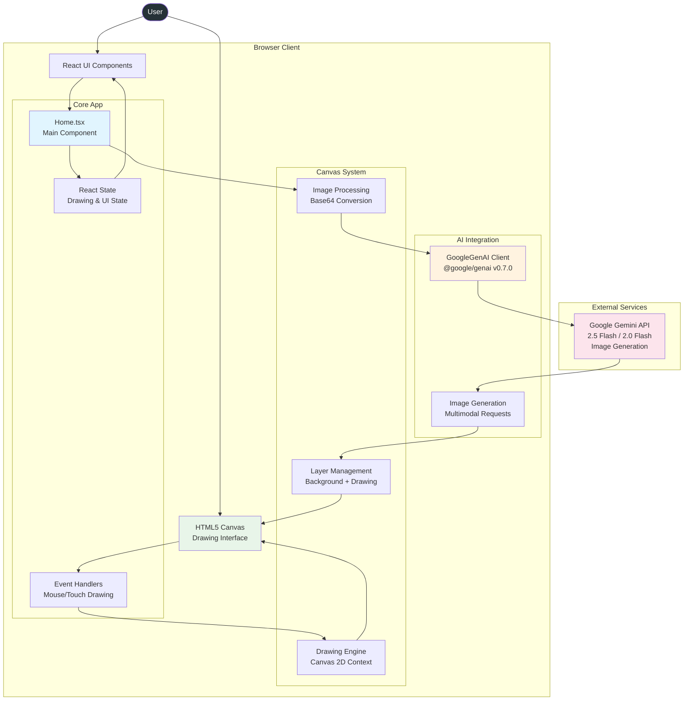
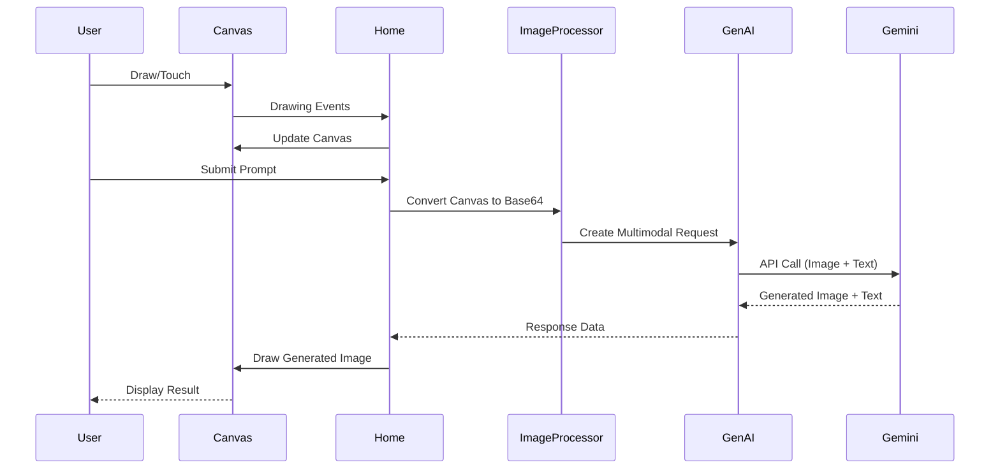

# Gemini Co-Drawing App Architecture

## High-Level System Architecture



## Component Architecture

### 1. **Single Component Design** (`Home.tsx`)
The entire app is built as one React component - demonstrating elegant simplicity:

```typescript
// Key state management
const [isDrawing, setIsDrawing] = useState(false);
const [penColor, setPenColor] = useState('#000000');
const [prompt, setPrompt] = useState('');
const [generatedImage, setGeneratedImage] = useState(null);
const [isLoading, setIsLoading] = useState(false);
```

### 2. **Canvas Management System**
- **Drawing Engine**: Real-time drawing with mouse/touch support
- **Layer System**: Background image + user drawings
- **Coordinate Scaling**: Proper scaling between display and internal canvas
- **Mobile Support**: Touch events with scroll prevention

### 3. **AI Integration Pattern**
```typescript
// Direct Gemini API integration
const ai = new GoogleGenAI({apiKey: process.env.GEMINI_API_KEY});

// Multimodal content structure
const contents = [
  {
    role: 'USER',
    parts: [{inlineData: {data: drawingData, mimeType: 'image/png'}}]
  },
  {
    role: 'USER',
    parts: [{text: `${prompt}. Keep the same minimal line drawing style.`}]
  }
];

// Generate with both text and image response
const response = await ai.models.generateContent({
  model: selectedModel,
  contents,
  config: {
    responseModalities: [Modality.TEXT, Modality.IMAGE]
  }
});
```

## Data Flow Diagram



## Key Features & Implementation

### 1. **Real-Time Drawing System**
```typescript
// Coordinate scaling for responsive canvas
const getCoordinates = (e) => {
  const canvas = canvasRef.current;
  const rect = canvas.getBoundingClientRect();
  const scaleX = canvas.width / rect.width;
  const scaleY = canvas.height / rect.height;

  return {
    x: (e.nativeEvent.offsetX || e.nativeEvent.touches?.[0]?.clientX - rect.left) * scaleX,
    y: (e.nativeEvent.offsetY || e.nativeEvent.touches?.[0]?.clientY - rect.top) * scaleY,
  };
};
```

### 2. **Image Processing Pipeline**
```typescript
// Clean canvas with white background for AI processing
const tempCanvas = document.createElement('canvas');
tempCanvas.width = canvas.width;
tempCanvas.height = canvas.height;
const tempCtx = tempCanvas.getContext('2d');

// Ensure white background
tempCtx.fillStyle = '#FFFFFF';
tempCtx.fillRect(0, 0, tempCanvas.width, tempCanvas.height);
tempCtx.drawImage(canvas, 0, 0);

// Convert to base64 for AI
const drawingData = tempCanvas.toDataURL('image/png').split(',')[1];
```

### 3. **Model Selection & Configuration**
- **Gemini 2.5 Flash Image Preview**: Latest and fastest
- **Gemini 2.0 Flash Preview**: Fallback option
- **Multimodal Response**: Both text explanation and generated image

### 4. **Error Handling Pattern**
```typescript
// Robust error parsing and user feedback
function parseError(error: string) {
  const regex = /{"error":(.*)}/gm;
  const m = regex.exec(error);
  try {
    const e = m[1];
    const err = JSON.parse(e);
    return err.message || error;
  } catch (e) {
    return error;
  }
}
```

## Technology Stack

### **Core Technologies**
- **Framework**: React 19.0.0 with TypeScript
- **Build Tool**: Vite 6.2.0 (fast development)
- **Styling**: Tailwind CSS 4.1.2 (browser version)
- **AI SDK**: @google/genai 0.7.0 (latest version)
- **Icons**: Lucide React 0.487.0

### **Canvas & Graphics**
- **HTML5 Canvas**: Native 2D drawing context
- **Touch Support**: Mobile-first drawing experience
- **Responsive Design**: Scales across devices
- **Layer Composition**: Background + drawing layers

### **Deployment & Build**
```json
{
  "scripts": {
    "dev": "vite",           // Development server
    "build": "vite build",   // Production build
    "preview": "vite preview" // Preview production
  }
}
```

## Architecture Strengths

### 1. **Extreme Simplicity**
- Single React component (505 lines)
- No complex state management
- Direct API integration
- Minimal dependencies

### 2. **Performance Optimized**
- Vite for fast development
- React 19 with modern features
- Canvas-based rendering (no DOM manipulation)
- Efficient base64 image handling

### 3. **User Experience**
- Real-time drawing feedback
- Loading states and error handling
- Mobile touch support
- Responsive design

### 4. **AI Integration Best Practices**
- Direct SDK usage (no wrapper APIs)
- Multimodal content structure
- Model selection flexibility
- Proper error handling

## How It Works: Step-by-Step

### **Drawing Phase**
1. User draws on HTML5 canvas with mouse/touch
2. Drawing events update canvas context in real-time
3. Color picker allows pen color changes
4. Clear button resets to white background

### **AI Generation Phase**
1. User enters text prompt for modifications
2. Canvas content converted to base64 PNG
3. Multimodal request sent to Gemini:
   - Image data (base64 PNG)
   - Text prompt with style instructions
4. Gemini generates new image maintaining drawing style
5. Response image set as canvas background
6. User can continue drawing on top

### **Technical Flow**
```
User Drawing → Canvas API → Base64 Conversion →
Gemini API (Text + Image) → Generated Image →
Canvas Background → Continue Drawing
```

## Benefits for Your V2 Terminal Portfolio

### 1. **Multimodal AI Integration Pattern**
```typescript
// Pattern you could adapt for terminal
const enhanceCommand = async (textInput: string, screenContext?: string) => {
  const contents = [
    { role: 'USER', parts: [{ text: textInput }] }
  ];

  if (screenContext) {
    contents.unshift({
      role: 'USER',
      parts: [{ inlineData: { data: screenContext, mimeType: 'image/png' } }]
    });
  }

  return await ai.models.generateContent({
    model: 'gemini-2.5-flash',
    contents,
    config: { responseModalities: [Modality.TEXT] }
  });
};
```

### 2. **Canvas-Based Interactive Features**
- **Terminal Graphics**: ASCII art generation
- **Code Visualization**: Flowcharts, diagrams
- **Interactive Demos**: Game overlays, visual tutorials
- **Screenshot Analysis**: Help users with visual debugging

### 3. **Simplified API Architecture**
- Direct Gemini SDK usage (you're already doing this!)
- No backend proxy needed
- Environment variable configuration
- Clean error handling patterns

### 4. **Real-Time Interaction Patterns**
```typescript
// Terminal could have similar real-time features
const handleTyping = (input: string) => {
  // Real-time command suggestions
  suggestCommands(input);

  // Context-aware help
  if (needsHelp(input)) {
    showInlineHelp(input);
  }
};
```

### 5. **Potential V2 Features You Could Add**

#### **Visual Command Builder**
```bash
$ draw-command --interactive
# Opens canvas to visually design command pipelines
```

#### **Screenshot Analysis**
```bash
$ analyze-screenshot ./error.png
# AI analyzes error screenshots and suggests solutions
```

#### **ASCII Art Generator**
```bash
$ ascii-art "generate a diagram of microservices architecture"
# AI generates ASCII diagrams for terminal display
```

#### **Interactive Code Visualizer**
```bash
$ visualize ./src/components/Terminal.ts
# Shows flow diagrams, dependency graphs
```

### 6. **Architecture Lessons**

#### **Keep It Simple**
- Single components can be powerful
- Direct API integration over abstraction
- State management doesn't need to be complex

#### **Focus on User Experience**
- Real-time feedback is crucial
- Loading states and error handling
- Mobile-first design considerations

#### **AI-First Design**
- Design UX around AI capabilities
- Multimodal thinking (text + images)
- Context-aware interactions

### 7. **Implementation Roadmap for V2**

#### **Phase 1: Visual Terminal Features**
- Canvas overlay for drawing/annotations
- Screenshot capture and analysis
- Visual command suggestions

#### **Phase 2: Multimodal Commands**
- Image input to commands (`cat image.png | analyze`)
- Visual output generation (`generate-diagram`)
- Context-aware help with screenshots

#### **Phase 3: Creative Tools**
- ASCII art generation
- Code flow visualization
- Interactive tutorials with graphics

The Gemini Co-Drawing app demonstrates that powerful AI features don't require complex architectures. Its simplicity and direct approach could inspire similar elegant solutions in your terminal portfolio.