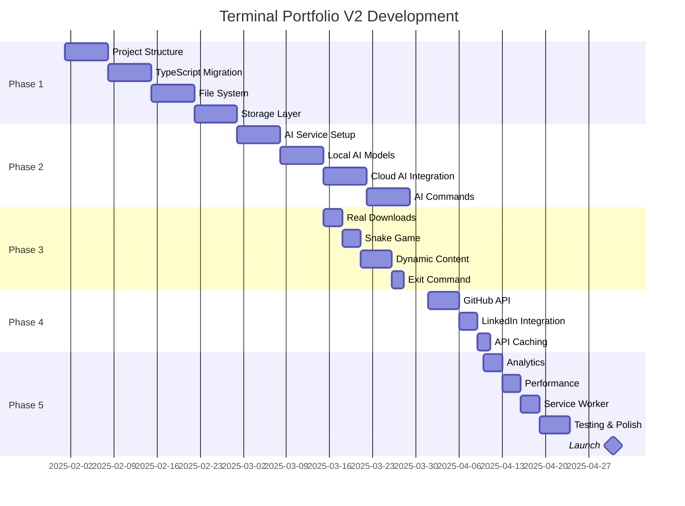

# Terminal Portfolio V2.0 - Foundation & AI Integration Roadmap

## Executive Summary
Transform the terminal portfolio from a mock simulation (V1.0) into a real, functioning terminal with actual file operations and AI-powered intelligence. Focus on eliminating all fake functionality while adding both local and cloud AI capabilities.

**Current Version:** V1.0 (Published - Mock Terminal)
**Target Version:** V2.0 (Real Terminal + AI)
**Development Timeline:** 3-4 months
**Core Philosophy:** "Make it Real, Make it Smart"

---

## Version Comparison

### V1.0 → V2.0 Transformation

| Feature | V1.0 (Current) | V2.0 (Target) |
|---------|----------------|---------------|
| File System | Hardcoded strings | Real file operations with IndexedDB/OPFS |
| Command Processing | Simple string matching | AI-enhanced natural language |
| Resume Download | Generated .txt file | Actual PDF from storage |
| Snake Game | "Coming soon" placeholder | Functional JavaScript game |
| Data Persistence | None | Full session persistence |
| Content Updates | Hardcoded | Dynamic CMS integration |
| User Analytics | None | Privacy-focused tracking |
| AI Features | None | Local + Cloud AI integration |
| API Integration | None | GitHub, LinkedIn APIs |

---

## Architecture Overview

### Tech Stack

```yaml
Frontend:
  - TypeScript (migrate from vanilla JS)
  - Modular architecture (no more single file)
  - Web Components for UI elements
  - Service Workers for offline support

Storage:
  - IndexedDB for file system
  - OPFS for large files
  - LocalStorage for settings
  - Cache API for offline content

AI Integration:
  - Local: TensorFlow.js for small models
  - Cloud: OpenAI/Claude/Gemini APIs
  - Hybrid: Local embeddings + cloud LLMs

Backend (Optional):
  - Cloudflare Workers for API proxy
  - Firebase for analytics & content
  - GitHub Actions for auto-updates
```

### System Architecture

```
┌──────────────────────────────────────┐
│          Terminal UI                  │
│      (TypeScript + Web Components)    │
├──────────────────────────────────────┤
│         Command Processor             │
│    (Natural Language + Traditional)   │
├──────────────────────────────────────┤
│          Core Services                │
├────────────┬─────────────┬───────────┤
│ File System│ AI Service  │ Game Engine│
│ (Real I/O) │(Local+Cloud)│  (Canvas)  │
├────────────┴─────────────┴───────────┤
│         Storage Layer                 │
│   (IndexedDB + OPFS + LocalStorage)  │
└──────────────────────────────────────┘
```

---

## Phase 1: Foundation Refactor (Month 1)

### 1.1 Project Structure Migration

**From single file to modular architecture:**

```
/src
  /core
    terminal.ts         # Core terminal class
    commandProcessor.ts # Command parsing & execution
    history.ts         # Command history management
  /filesystem
    fileSystem.ts      # Virtual file system
    storage.ts         # IndexedDB/OPFS integration
    fileTypes.ts       # File type definitions
  /commands
    system.ts          # System commands (ls, cd, cat, etc.)
    info.ts           # Info commands (about, skills, etc.)
    contact.ts        # Contact commands
    games.ts          # Game commands
  /ai
    aiService.ts      # AI service interface
    localAI.ts        # TensorFlow.js integration
    cloudAI.ts        # Cloud API integration
  /ui
    components/       # Web components
    themes/          # Terminal themes
  /utils
    config.ts        # Configuration
    analytics.ts     # Privacy-focused analytics
  /content
    resume.pdf       # Actual PDF file
    projects.json    # Dynamic content
    skills.json      # Dynamic skills data
```

### 1.2 Real File System Implementation

**Replace mock file system with actual storage:**

```typescript
// filesystem/fileSystem.ts
export class VirtualFileSystem {
  private db: IDBDatabase;
  private cache: Map<string, File> = new Map();

  async initialize() {
    this.db = await this.openDatabase();
    await this.createDefaultStructure();
  }

  async createFile(path: string, content: Blob): Promise<void> {
    const file = new File([content], path);

    // Store in IndexedDB
    const tx = this.db.transaction(['files'], 'readwrite');
    await tx.objectStore('files').put({
      path,
      content: await file.arrayBuffer(),
      type: file.type,
      size: file.size,
      modified: Date.now()
    });

    // Update cache
    this.cache.set(path, file);
  }

  async readFile(path: string): Promise<File | null> {
    // Check cache first
    if (this.cache.has(path)) {
      return this.cache.get(path)!;
    }

    // Load from IndexedDB
    const tx = this.db.transaction(['files'], 'readonly');
    const data = await tx.objectStore('files').get(path);

    if (data) {
      const file = new File([data.content], path, { type: data.type });
      this.cache.set(path, file);
      return file;
    }

    return null;
  }

  async listDirectory(path: string): Promise<string[]> {
    const tx = this.db.transaction(['files'], 'readonly');
    const files = await tx.objectStore('files').getAllKeys();

    return files
      .filter(f => f.startsWith(path))
      .map(f => f.replace(path + '/', '').split('/')[0])
      .filter((f, i, arr) => arr.indexOf(f) === i);
  }

  async deleteFile(path: string): Promise<void> {
    const tx = this.db.transaction(['files'], 'readwrite');
    await tx.objectStore('files').delete(path);
    this.cache.delete(path);
  }
}
```

### 1.3 TypeScript Migration

**Core terminal class in TypeScript:**

```typescript
// core/terminal.ts
export interface Command {
  name: string;
  description: string;
  usage?: string;
  execute: (args: string[]) => Promise<void> | void;
}

export class Terminal {
  private commands: Map<string, Command> = new Map();
  private fileSystem: VirtualFileSystem;
  private history: CommandHistory;
  private output: HTMLElement;
  private input: HTMLInputElement;
  private currentPath: string = '~';

  constructor(config: TerminalConfig) {
    this.output = config.outputElement;
    this.input = config.inputElement;
    this.fileSystem = new VirtualFileSystem();
    this.history = new CommandHistory();
  }

  async initialize(): Promise<void> {
    await this.fileSystem.initialize();
    await this.loadCommands();
    await this.restoreSession();
    this.attachEventListeners();
    await this.runStartupSequence();
  }

  registerCommand(command: Command): void {
    this.commands.set(command.name, command);
  }

  async executeCommand(input: string): Promise<void> {
    const [cmdName, ...args] = this.parseInput(input);

    // Save to history
    await this.history.add(input);

    // Execute command
    const command = this.commands.get(cmdName);
    if (command) {
      try {
        await command.execute(args);
      } catch (error) {
        this.printError(`Error: ${error.message}`);
      }
    } else {
      // Try AI command parsing
      const aiCommand = await this.aiService.parseCommand(input);
      if (aiCommand) {
        await this.executeCommand(aiCommand);
      } else {
        this.printError(`Command not found: ${cmdName}`);
      }
    }
  }
}
```

---

## Phase 2: AI Integration (Month 2)

### 2.1 AI Service Architecture

**Hybrid AI approach - local for speed, cloud for capability:**

```typescript
// ai/aiService.ts
export class AIService {
  private localAI: LocalAI;
  private cloudAI: CloudAI;
  private embeddings: EmbeddingModel;

  async initialize() {
    // Load local models
    this.embeddings = await this.loadEmbeddingModel();
    this.localAI = new LocalAI();

    // Initialize cloud connections
    this.cloudAI = new CloudAI({
      openai: process.env.OPENAI_API_KEY,
      anthropic: process.env.ANTHROPIC_API_KEY,
      gemini: process.env.GEMINI_API_KEY
    });
  }

  // Natural language to terminal command
  async parseCommand(input: string): Promise<string | null> {
    // First try local parsing for common patterns
    const localResult = await this.localAI.parseCommand(input);
    if (localResult.confidence > 0.8) {
      return localResult.command;
    }

    // Fall back to cloud for complex queries
    return await this.cloudAI.parseCommand(input);
  }

  // Intelligent command suggestions
  async suggestCommands(context: string[]): Promise<string[]> {
    const embeddings = await this.embeddings.encode(context);
    return await this.localAI.predictNext(embeddings);
  }

  // Content-based Q&A about portfolio
  async answerQuestion(question: string): Promise<string> {
    // Use RAG pattern
    const relevantDocs = await this.findRelevantContent(question);
    return await this.cloudAI.generateAnswer(question, relevantDocs);
  }
}
```

### 2.2 Local AI Models

**TensorFlow.js for lightweight models:**

```typescript
// ai/localAI.ts
import * as tf from '@tensorflow/tfjs';

export class LocalAI {
  private commandModel: tf.LayersModel;
  private embeddingModel: tf.GraphModel;

  async initialize() {
    // Load small command parsing model (~5MB)
    this.commandModel = await tf.loadLayersModel('/models/command_parser.json');

    // Load embedding model for semantic search (~25MB)
    this.embeddingModel = await tf.loadGraphModel('/models/universal_sentence_encoder');
  }

  async parseCommand(input: string): Promise<{command: string, confidence: number}> {
    // Tokenize and encode input
    const encoded = await this.encode(input);

    // Predict command
    const prediction = this.commandModel.predict(encoded) as tf.Tensor;
    const [command, confidence] = await this.decodePredicition(prediction);

    return { command, confidence };
  }

  async semanticSearch(query: string, documents: string[]): Promise<number[]> {
    // Encode query and documents
    const queryEmbed = await this.embeddingModel.predict(query);
    const docEmbeds = await Promise.all(
      documents.map(doc => this.embeddingModel.predict(doc))
    );

    // Calculate cosine similarities
    const similarities = docEmbeds.map(docEmbed =>
      this.cosineSimilarity(queryEmbed, docEmbed)
    );

    // Return sorted indices
    return similarities
      .map((sim, idx) => ({ sim, idx }))
      .sort((a, b) => b.sim - a.sim)
      .map(item => item.idx);
  }
}
```

### 2.3 Cloud AI Integration

**Multiple providers with fallback:**

```typescript
// ai/cloudAI.ts
export class CloudAI {
  private providers: AIProvider[] = [];

  constructor(config: CloudAIConfig) {
    if (config.openai) {
      this.providers.push(new OpenAIProvider(config.openai));
    }
    if (config.anthropic) {
      this.providers.push(new AnthropicProvider(config.anthropic));
    }
    if (config.gemini) {
      this.providers.push(new GeminiProvider(config.gemini));
    }
  }

  async parseCommand(input: string): Promise<string> {
    const prompt = `
      Convert the following natural language to a terminal command.
      Context: This is a portfolio terminal showcasing Fadi's skills.

      User input: "${input}"

      Examples:
      - "show me your Python experience" → "cat skills/python.txt"
      - "what projects have you done?" → "ls projects"
      - "tell me about yourself" → "about"

      Return only the command, nothing else.
    `;

    // Try each provider with fallback
    for (const provider of this.providers) {
      try {
        const response = await provider.complete(prompt);
        return response.trim();
      } catch (error) {
        console.warn(`Provider ${provider.name} failed:`, error);
      }
    }

    return null;
  }

  async generateAnswer(question: string, context: string[]): Promise<string> {
    const prompt = `
      You are Fadi's portfolio assistant. Answer questions based on the provided context.

      Context:
      ${context.join('\n\n')}

      Question: ${question}

      Answer concisely and accurately. If the information isn't in the context, say so.
    `;

    return await this.providers[0].complete(prompt);
  }
}
```

### 2.4 AI-Powered Features

**Smart command suggestions:**

```typescript
// commands/aiCommands.ts
export class AICommands {
  @Command('ask', 'Ask questions about Fadi\'s experience')
  async ask(args: string[]): Promise<void> {
    const question = args.join(' ');
    const answer = await this.aiService.answerQuestion(question);
    this.terminal.print(answer);
  }

  @Command('suggest', 'Get command suggestions')
  async suggest(): Promise<void> {
    const context = this.terminal.getRecentCommands(5);
    const suggestions = await this.aiService.suggestCommands(context);

    this.terminal.print('Based on your activity, try these commands:');
    suggestions.forEach(cmd => {
      this.terminal.print(`  • ${cmd}`);
    });
  }

  @Command('explain', 'Explain a project or skill in detail')
  async explain(args: string[]): Promise<void> {
    const topic = args.join(' ');
    const explanation = await this.aiService.explainTopic(topic);
    this.terminal.print(explanation);
  }

  @Command('match', 'Match your needs to Fadi\'s skills')
  async match(args: string[]): Promise<void> {
    const requirements = args.join(' ');
    const matches = await this.aiService.matchSkills(requirements);

    this.terminal.print('Relevant skills and experience:');
    matches.forEach(match => {
      this.terminal.print(`  • ${match.skill} (${match.relevance}% match)`);
      this.terminal.print(`    ${match.evidence}`);
    });
  }
}
```

---

## Phase 3: Eliminating Mock Features (Month 2-3)

### 3.1 Real Resume Download

**Store and serve actual PDF:**

```typescript
// commands/download.ts
export class DownloadCommand {
  async execute(args: string[]): Promise<void> {
    if (args[0] === 'resume' || args[0] === 'cv') {
      // Load actual PDF from storage
      const file = await this.fileSystem.readFile('/docs/resume.pdf');

      if (file) {
        // Create download link
        const url = URL.createObjectURL(file);
        const a = document.createElement('a');
        a.href = url;
        a.download = 'Fadi_Al_Zuabi_Resume.pdf';
        a.click();
        URL.revokeObjectURL(url);

        this.terminal.print('Downloading resume.pdf...');
      } else {
        this.terminal.printError('Resume file not found');
      }
    }
  }
}
```

### 3.2 Functional Snake Game

**Simple but complete Snake implementation:**

```typescript
// games/snake.ts
export class SnakeGame {
  private canvas: HTMLCanvasElement;
  private ctx: CanvasRenderingContext2D;
  private snake: Point[] = [];
  private food: Point;
  private direction: Point = { x: 1, y: 0 };
  private score: number = 0;
  private gameLoop: number;

  async start(): Promise<void> {
    // Create game canvas in terminal
    this.canvas = this.terminal.createCanvas(400, 400);
    this.ctx = this.canvas.getContext('2d')!;

    // Initialize game
    this.snake = [{ x: 10, y: 10 }];
    this.spawnFood();

    // Set up controls
    this.setupKeyboardControls();

    // Start game loop
    this.gameLoop = setInterval(() => this.update(), 100);

    this.terminal.print('Snake Game Started! Use arrow keys to play.');
    this.terminal.print('Press ESC to exit.');
  }

  private update(): void {
    // Move snake
    const head = { ...this.snake[0] };
    head.x += this.direction.x;
    head.y += this.direction.y;

    // Check collision with walls
    if (head.x < 0 || head.x >= 20 || head.y < 0 || head.y >= 20) {
      this.gameOver();
      return;
    }

    // Check self collision
    if (this.snake.some(segment => segment.x === head.x && segment.y === head.y)) {
      this.gameOver();
      return;
    }

    this.snake.unshift(head);

    // Check food collision
    if (head.x === this.food.x && head.y === this.food.y) {
      this.score += 10;
      this.spawnFood();
      this.terminal.updateStatus(`Score: ${this.score}`);
    } else {
      this.snake.pop();
    }

    this.render();
  }

  private render(): void {
    // Clear canvas
    this.ctx.fillStyle = '#0a0e27';
    this.ctx.fillRect(0, 0, 400, 400);

    // Draw snake
    this.ctx.fillStyle = '#00ff41';
    this.snake.forEach(segment => {
      this.ctx.fillRect(segment.x * 20, segment.y * 20, 18, 18);
    });

    // Draw food
    this.ctx.fillStyle = '#ff0041';
    this.ctx.fillRect(this.food.x * 20, this.food.y * 20, 18, 18);
  }

  private gameOver(): void {
    clearInterval(this.gameLoop);
    this.terminal.print(`Game Over! Final Score: ${this.score}`);
    this.terminal.print('Type "snake" to play again.');
    this.terminal.removeCanvas(this.canvas);
  }
}
```

### 3.3 Dynamic Content Management

**Load content from JSON/API instead of hardcoding:**

```typescript
// content/contentManager.ts
export class ContentManager {
  private content: Map<string, any> = new Map();

  async initialize(): Promise<void> {
    // Load content from JSON files or API
    await this.loadContent();

    // Set up auto-refresh
    this.setupAutoRefresh();
  }

  private async loadContent(): Promise<void> {
    const sources = [
      { key: 'projects', url: '/content/projects.json' },
      { key: 'skills', url: '/content/skills.json' },
      { key: 'experience', url: '/content/experience.json' },
      { key: 'education', url: '/content/education.json' }
    ];

    await Promise.all(sources.map(async source => {
      const response = await fetch(source.url);
      const data = await response.json();
      this.content.set(source.key, data);
    }));
  }

  async getProjects(): Promise<Project[]> {
    return this.content.get('projects') || [];
  }

  async getSkills(): Promise<Skill[]> {
    return this.content.get('skills') || [];
  }

  private setupAutoRefresh(): void {
    // Refresh content every hour
    setInterval(() => this.loadContent(), 3600000);
  }
}
```

### 3.4 Real Exit Command

**Proper terminal exit with session save:**

```typescript
// commands/system.ts
export class ExitCommand {
  async execute(): Promise<void> {
    // Save session
    await this.terminal.saveSession();

    // Show goodbye message
    await this.terminal.typeWriter('Saving session...');
    await this.terminal.typeWriter('Session saved successfully.');
    await this.terminal.typeWriter('Goodbye! Thanks for visiting.');

    // Options for exit behavior
    setTimeout(() => {
      // Option 1: Close tab (if allowed)
      window.close();

      // Option 2: Clear terminal and show restart button
      this.terminal.clear();
      this.terminal.showRestartButton();

      // Option 3: Navigate to main portfolio
      // window.location.href = 'https://www.zuabi.dev';
    }, 1500);
  }
}
```

---

## Phase 4: External API Integration (Month 3)

### 4.1 GitHub Integration

**Show real GitHub stats and activity:**

```typescript
// integrations/github.ts
export class GitHubIntegration {
  private octokit: Octokit;
  private cache: Map<string, CachedData> = new Map();

  constructor(token?: string) {
    this.octokit = new Octokit({
      auth: token || process.env.GITHUB_TOKEN
    });
  }

  async getRecentActivity(): Promise<Activity[]> {
    const { data } = await this.octokit.rest.activity.listPublicEventsForUser({
      username: 'fadizuabi',
      per_page: 10
    });

    return data.map(event => ({
      type: event.type,
      repo: event.repo.name,
      created: event.created_at,
      description: this.formatEvent(event)
    }));
  }

  async getRepositoryStats(): Promise<RepoStats[]> {
    const { data } = await this.octokit.rest.repos.listForUser({
      username: 'fadizuabi',
      sort: 'updated',
      per_page: 10
    });

    return data.map(repo => ({
      name: repo.name,
      description: repo.description,
      language: repo.language,
      stars: repo.stargazers_count,
      forks: repo.forks_count,
      updated: repo.updated_at
    }));
  }

  async getContributionGraph(): Promise<ContributionDay[]> {
    // Use GitHub GraphQL API for contribution graph
    const query = `
      query($username: String!) {
        user(login: $username) {
          contributionsCollection {
            contributionCalendar {
              weeks {
                contributionDays {
                  contributionCount
                  date
                }
              }
            }
          }
        }
      }
    `;

    const result = await this.octokit.graphql(query, { username: 'fadizuabi' });
    return this.flattenContributions(result);
  }
}
```

### 4.2 LinkedIn Integration (Limited)

**Show professional info (within API limits):**

```typescript
// integrations/linkedin.ts
export class LinkedInIntegration {
  // Note: LinkedIn API is restrictive, consider web scraping alternatives
  // or manual updates to JSON file

  async getProfileSummary(): Promise<ProfileSummary> {
    // Option 1: Use stored/cached data
    const cached = await this.loadCachedProfile();

    // Option 2: Use LinkedIn API (requires OAuth flow)
    // This is complex and has limitations

    return cached;
  }

  async getRecommendations(): Promise<Recommendation[]> {
    // Load from stored JSON (manually updated)
    const response = await fetch('/content/linkedin_recommendations.json');
    return await response.json();
  }
}
```

---

## Phase 5: Performance & Analytics (Month 3-4)

### 5.1 Privacy-Focused Analytics

**Track usage without compromising privacy:**

```typescript
// analytics/analytics.ts
export class Analytics {
  private events: AnalyticsEvent[] = [];

  track(event: string, properties?: Record<string, any>): void {
    // Only track non-identifying information
    this.events.push({
      event,
      properties: this.sanitize(properties),
      timestamp: Date.now(),
      sessionId: this.getSessionId()
    });

    // Send batch updates
    this.scheduleBatchSend();
  }

  private sanitize(properties?: Record<string, any>): Record<string, any> {
    // Remove any PII
    const safe = { ...properties };
    delete safe.ip;
    delete safe.email;
    delete safe.name;
    return safe;
  }

  trackCommandUsage(command: string): void {
    this.track('command_executed', {
      command: command.split(' ')[0], // Only track command name
      category: this.categorizeCommand(command)
    });
  }

  trackEngagement(): void {
    this.track('engagement', {
      sessionDuration: this.getSessionDuration(),
      commandCount: this.getCommandCount(),
      featuresUsed: this.getFeaturesUsed()
    });
  }
}
```

### 5.2 Performance Optimization

**Code splitting and lazy loading:**

```typescript
// core/lazyLoader.ts
export class LazyLoader {
  private loaded: Set<string> = new Set();

  async loadFeature(feature: string): Promise<void> {
    if (this.loaded.has(feature)) return;

    switch (feature) {
      case 'ai':
        await import('../ai/aiService');
        break;

      case 'games':
        await import('../games/index');
        break;

      case 'visualization':
        await import('../visualization/index');
        break;

      case 'github':
        await import('../integrations/github');
        break;
    }

    this.loaded.add(feature);
  }
}
```

### 5.3 Service Worker for Offline Support

```typescript
// sw.ts
self.addEventListener('install', (event: ExtendableEvent) => {
  event.waitUntil(
    caches.open('terminal-v2').then(cache => {
      return cache.addAll([
        '/',
        '/css/terminal.css',
        '/js/terminal.js',
        '/content/projects.json',
        '/content/skills.json',
        '/models/command_parser.json'
      ]);
    })
  );
});

self.addEventListener('fetch', (event: FetchEvent) => {
  event.respondWith(
    caches.match(event.request).then(response => {
      return response || fetch(event.request).then(fetchResponse => {
        return caches.open('terminal-v2').then(cache => {
          cache.put(event.request, fetchResponse.clone());
          return fetchResponse;
        });
      });
    })
  );
});
```

---

## Implementation Timeline



---

## Testing Strategy

### Unit Tests (Jest + Testing Library)

```typescript
// __tests__/fileSystem.test.ts
describe('VirtualFileSystem', () => {
  let fs: VirtualFileSystem;

  beforeEach(async () => {
    fs = new VirtualFileSystem();
    await fs.initialize();
  });

  test('creates and reads files', async () => {
    const content = new Blob(['Hello, World!']);
    await fs.createFile('/test.txt', content);

    const file = await fs.readFile('/test.txt');
    expect(file).not.toBeNull();
    expect(await file!.text()).toBe('Hello, World!');
  });

  test('lists directory contents', async () => {
    await fs.createFile('/dir/file1.txt', new Blob(['1']));
    await fs.createFile('/dir/file2.txt', new Blob(['2']));

    const files = await fs.listDirectory('/dir');
    expect(files).toContain('file1.txt');
    expect(files).toContain('file2.txt');
  });
});
```

### Integration Tests

```typescript
// __tests__/ai.integration.test.ts
describe('AI Integration', () => {
  test('parses natural language commands', async () => {
    const ai = new AIService();
    await ai.initialize();

    const command = await ai.parseCommand('show me your Python projects');
    expect(command).toMatch(/ls.*projects.*python|grep.*python/i);
  });

  test('provides relevant suggestions', async () => {
    const ai = new AIService();
    await ai.initialize();

    const context = ['ls projects', 'cd solidigm'];
    const suggestions = await ai.suggestCommands(context);

    expect(suggestions).toContain('cat gen5-ssd.md');
  });
});
```

---

## Deployment Configuration

### Build Process

```json
// package.json
{
  "name": "terminal-portfolio-v2",
  "version": "2.0.0",
  "scripts": {
    "dev": "vite",
    "build": "tsc && vite build",
    "test": "jest",
    "test:e2e": "playwright test",
    "analyze": "vite-bundle-visualizer",
    "deploy": "npm run build && npm run deploy:cdn"
  },
  "dependencies": {
    "@tensorflow/tfjs": "^4.10.0",
    "idb": "^7.1.1",
    "openai": "^4.0.0",
    "@google/generative-ai": "^0.1.0"
  },
  "devDependencies": {
    "typescript": "^5.0.0",
    "vite": "^5.0.0",
    "jest": "^29.0.0",
    "@testing-library/dom": "^9.0.0",
    "playwright": "^1.40.0"
  }
}
```

### Environment Variables

```env
# .env.example
VITE_OPENAI_API_KEY=your_key_here
VITE_ANTHROPIC_API_KEY=your_key_here
VITE_GEMINI_API_KEY=your_key_here
VITE_GITHUB_TOKEN=your_token_here
VITE_ANALYTICS_ID=your_id_here
```

---

## Success Metrics

### Performance KPIs
- Initial Load: < 3 seconds
- Time to Interactive: < 4 seconds
- Command Response: < 100ms (local), < 1s (AI)
- Lighthouse Score: > 90

### Feature Completion
- ✅ All mock features replaced with real implementations
- ✅ File system with persistence
- ✅ AI command parsing functional
- ✅ Real PDF resume download
- ✅ Playable Snake game
- ✅ GitHub integration showing real data

### User Engagement
- Average session: > 3 minutes
- Commands per session: > 8
- AI feature usage: > 30% of sessions
- Return visitor rate: > 25%

---

## Migration Guide from V1

### For Users
1. Session data will be preserved
2. New AI commands available (`ask`, `suggest`, `explain`)
3. Real file operations (`touch`, `mkdir`, `rm`)
4. Improved performance and offline support

### For Development
1. Fork V1 repository
2. Create `v2-development` branch
3. Migrate file by file following the new structure
4. Maintain V1 at current URL during development
5. Deploy V2 to staging environment for testing
6. Switch production after thorough testing

---

## Risk Mitigation

| Risk | Impact | Mitigation |
|------|--------|------------|
| AI API costs | Medium | Use local models first, cache responses |
| Large model downloads | High | Progressive loading, show progress |
| Browser storage limits | Low | Implement cleanup, use OPFS for large files |
| TypeScript learning curve | Low | Gradual migration, strong typing benefits |
| Breaking changes from V1 | Medium | Feature flags, gradual rollout |

---

## Open Questions

1. **AI Provider Priority**: Which AI provider should be primary?
2. **Storage Limits**: How much data to store locally (10MB? 50MB?)
3. **Command Compatibility**: Keep all V1 commands or deprecate some?
4. **Mobile Experience**: Full features or simplified version?
5. **API Key Management**: User-provided or proxy through backend?

---

## Next Steps

### Week 1
- [ ] Set up TypeScript project structure
- [ ] Implement basic file system with IndexedDB
- [ ] Create modular command system
- [ ] Set up testing framework

### Week 2
- [ ] Integrate TensorFlow.js
- [ ] Implement local AI command parsing
- [ ] Add cloud AI fallback
- [ ] Create AI command features

### Week 3
- [ ] Replace all mock features
- [ ] Implement Snake game
- [ ] Add GitHub integration
- [ ] Set up analytics

### Week 4
- [ ] Performance optimization
- [ ] Add service worker
- [ ] Complete testing
- [ ] Prepare for launch

---

## Conclusion

V2.0 transforms the portfolio from a clever simulation into a real, functional terminal with AI intelligence. By eliminating all mock features and adding both local and cloud AI capabilities, this version provides genuine utility while showcasing modern development skills.

The focus on real implementations (file system, games, API integrations) combined with AI enhancements creates a unique portfolio experience that's both impressive and useful.

**Estimated Timeline**: 3-4 months
**Effort**: 200-250 hours
**Key Innovation**: Real terminal + AI intelligence

---

*"Version 2: Where simulation becomes reality, and commands become conversations."*