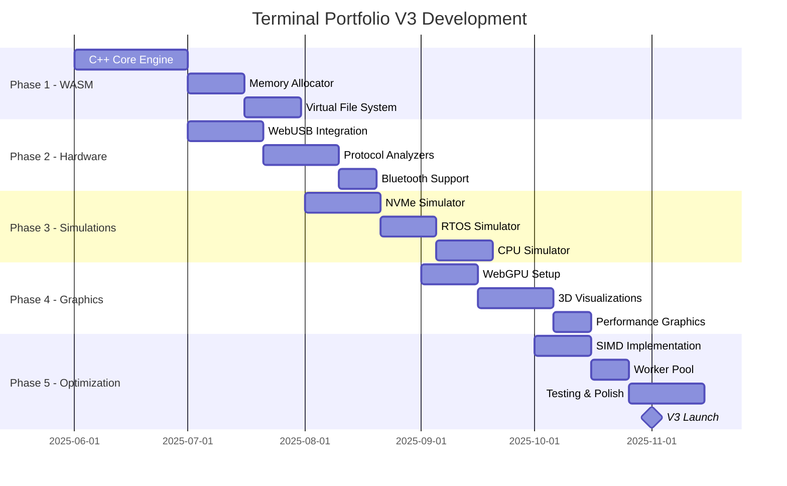

# Terminal Portfolio V3.0 - Advanced Engineering Showcase Roadmap

## Executive Summary
Build upon V2's real terminal and AI foundation to create an advanced engineering showcase featuring WebAssembly performance, hardware integration, 3D visualizations, and cutting-edge web technologies that demonstrate firmware-level expertise in the browser.

**Current Version:** V2.0 (Real Terminal + AI)
**Target Version:** V3.0 (Engineering Powerhouse)
**Development Timeline:** 4-6 months
**Core Philosophy:** "Demonstrate Engineering Excellence Through Live Examples"

---

## Version Evolution

### V2.0 → V3.0 Transformation

| Feature | V2.0 (Foundation) | V3.0 (Advanced) |
|---------|-------------------|-----------------|
| Core Engine | TypeScript | C++ WebAssembly |
| Performance | Standard JS | SIMD + WebGPU acceleration |
| Visualization | Terminal only | 3D graphics + WebGL |
| Hardware | None | WebUSB/Serial/Bluetooth |
| Concurrency | Single thread | SharedArrayBuffer + Workers |
| Compilation | Runtime interpreted | JIT + WASM compilation |
| Debugging | Console logs | Custom debugger interface |
| Networking | REST APIs | WebRTC + WebSockets |

---

## Architecture Overview

### Advanced Tech Stack

```yaml
Core Technologies:
  - WebAssembly: C++, Rust modules
  - WebGPU: Compute shaders, parallel processing
  - WebGL 2.0: 3D visualizations
  - Web Workers: True parallelism
  - SharedArrayBuffer: Shared memory

Engineering Demos:
  - NVMe controller simulation
  - RTOS scheduler visualization
  - Memory allocator showcase
  - Protocol analyzers (I2C, SPI, UART)
  - CPU architecture simulator

Hardware Integration:
  - WebUSB: Arduino, STM32
  - WebSerial: UART communication
  - WebBluetooth: BLE devices
  - WebNFC: Tag reading/writing
  - WebMIDI: Music controllers

Graphics & Compute:
  - Three.js: 3D scenes
  - WebGPU: GPU compute
  - Canvas 2D: Performance graphics
  - WebXR: VR/AR support
```

### System Architecture

```
┌────────────────────────────────────────┐
│        Advanced Terminal UI             │
│    (React + Three.js + WebComponents)  │
├────────────────────────────────────────┤
│       WebAssembly Core (C++)           │
│    ┌─────────────┬──────────────┐     │
│    │ NVMe Sim    │ RTOS Sim     │     │
│    │ Memory Mgr  │ CPU Emulator │     │
│    └─────────────┴──────────────┘     │
├────────────────────────────────────────┤
│         Parallel Computing              │
│    (WebWorkers + SharedArrayBuffer)    │
├────────────────────────────────────────┤
│      GPU Acceleration (WebGPU)         │
│    ┌─────────────┬──────────────┐     │
│    │ Compute     │ Graphics     │     │
│    │ Shaders     │ Pipeline     │     │
│    └─────────────┴──────────────┘     │
├────────────────────────────────────────┤
│      Hardware Interface Layer          │
│  (USB | Serial | Bluetooth | NFC)      │
└────────────────────────────────────────┘
```

---

## Phase 1: WebAssembly Core (Month 1-2)

### 1.1 C++ Terminal Engine

**High-performance terminal in C++:**

```cpp
// src/cpp/terminal_engine.h
#pragma once
#include <emscripten/bind.h>
#include <memory>
#include <vector>
#include <map>

class TerminalEngine {
private:
    struct Command {
        std::string name;
        std::function<void(const std::vector<std::string>&)> handler;
        std::string description;
    };

    std::map<std::string, Command> commands;
    std::unique_ptr<FileSystem> fs;
    std::unique_ptr<ProcessManager> procMgr;
    std::unique_ptr<MemoryAllocator> allocator;

public:
    TerminalEngine();

    // Core functionality
    std::string executeCommand(const std::string& cmd);
    void registerCommand(const std::string& name,
                        const std::function<void(const std::vector<std::string>&)>& handler);

    // Performance metrics
    struct PerformanceMetrics {
        uint64_t executionTimeNs;
        size_t memoryUsed;
        size_t instructionsExecuted;
    };

    PerformanceMetrics getLastMetrics() const;
};

// Emscripten bindings
EMSCRIPTEN_BINDINGS(terminal_module) {
    emscripten::class_<TerminalEngine>("TerminalEngine")
        .constructor()
        .function("executeCommand", &TerminalEngine::executeCommand)
        .function("getLastMetrics", &TerminalEngine::getLastMetrics);
}
```

### 1.2 Custom Memory Allocator

**Showcase embedded systems expertise:**

```cpp
// src/cpp/memory_allocator.h
class CustomAllocator {
private:
    struct Block {
        size_t size;
        bool free;
        Block* next;
        Block* prev;
    };

    uint8_t* heap;
    size_t heapSize;
    Block* freeList;

    // Statistics
    struct Stats {
        size_t totalAllocated;
        size_t peakUsage;
        size_t fragmentationRatio;
        uint32_t allocCount;
        uint32_t freeCount;
    };

    Stats stats;

public:
    CustomAllocator(size_t size);
    ~CustomAllocator();

    void* allocate(size_t size, size_t alignment = 8);
    void deallocate(void* ptr);

    // Advanced features
    void* reallocate(void* ptr, size_t newSize);
    void defragment();

    // Visualization support
    std::vector<BlockInfo> getMemoryMap() const;
    Stats getStatistics() const;

    // Demonstrate different allocation strategies
    enum Strategy {
        FIRST_FIT,
        BEST_FIT,
        WORST_FIT,
        BUDDY_SYSTEM
    };

    void setStrategy(Strategy s);
};
```

### 1.3 Virtual File System in WASM

**POSIX-compliant file system:**

```cpp
// src/cpp/vfs.h
class VirtualFileSystem {
private:
    struct INode {
        enum Type { FILE, DIRECTORY, SYMLINK, DEVICE };
        Type type;
        size_t size;
        uint32_t permissions;
        time_t created;
        time_t modified;
        std::vector<uint8_t> data;
        std::map<std::string, std::shared_ptr<INode>> children;
    };

    std::shared_ptr<INode> root;
    std::map<int, FileDescriptor> openFiles;
    int nextFd = 3; // 0,1,2 reserved for stdin/out/err

public:
    // POSIX-like API
    int open(const char* path, int flags, mode_t mode = 0644);
    ssize_t read(int fd, void* buf, size_t count);
    ssize_t write(int fd, const void* buf, size_t count);
    off_t lseek(int fd, off_t offset, int whence);
    int close(int fd);

    // Directory operations
    int mkdir(const char* path, mode_t mode);
    int rmdir(const char* path);
    DIR* opendir(const char* path);
    struct dirent* readdir(DIR* dirp);

    // Advanced features
    int mmap(void* addr, size_t length, int prot, int flags, int fd, off_t offset);
    int ioctl(int fd, unsigned long request, ...);

    // File system operations
    int mount(const char* source, const char* target, const char* fstype);
    int umount(const char* target);
};
```

---

## Phase 2: Hardware Integration (Month 2-3)

### 2.1 WebUSB Arduino Interface

**Direct hardware control from browser:**

```typescript
// src/hardware/arduino.ts
export class ArduinoInterface {
  private device: USBDevice;
  private interfaceNumber: number;
  private endpointIn: number;
  private endpointOut: number;

  async connect(): Promise<void> {
    this.device = await navigator.usb.requestDevice({
      filters: [
        { vendorId: 0x2341, productId: 0x0043 }, // Arduino Uno
        { vendorId: 0x2341, productId: 0x0010 }, // Arduino Mega
      ]
    });

    await this.device.open();
    await this.device.selectConfiguration(1);
    await this.device.claimInterface(2);

    // Set up serial communication
    await this.device.controlTransferOut({
      requestType: 'class',
      recipient: 'interface',
      request: 0x22,
      value: 0x01,
      index: 2
    });
  }

  async sendCommand(command: Uint8Array): Promise<void> {
    await this.device.transferOut(this.endpointOut, command);
  }

  async readData(): Promise<Uint8Array> {
    const result = await this.device.transferIn(this.endpointIn, 64);
    return new Uint8Array(result.data.buffer);
  }

  // Firmware operations
  async uploadFirmware(hexFile: ArrayBuffer): Promise<void> {
    // Implement STK500 protocol for firmware upload
    const programmer = new STK500Programmer(this.device);
    await programmer.upload(hexFile);
  }
}
```

### 2.2 Protocol Analyzers

**I2C, SPI, UART analyzers:**

```cpp
// src/cpp/protocol_analyzer.h
class ProtocolAnalyzer {
public:
    enum Protocol { I2C, SPI, UART, CAN };

    struct Sample {
        uint64_t timestamp;
        uint8_t data;
        uint8_t flags; // Start, Stop, ACK, NACK, etc.
    };

    struct Transaction {
        Protocol protocol;
        uint64_t startTime;
        uint64_t endTime;
        std::vector<uint8_t> data;
        bool success;
        std::string decoded;
    };

    // Analyze raw signal data
    std::vector<Transaction> analyzeI2C(const std::vector<Sample>& sda,
                                        const std::vector<Sample>& scl);

    std::vector<Transaction> analyzeSPI(const std::vector<Sample>& miso,
                                        const std::vector<Sample>& mosi,
                                        const std::vector<Sample>& sck,
                                        const std::vector<Sample>& cs);

    std::vector<Transaction> analyzeUART(const std::vector<Sample>& rx,
                                         uint32_t baudRate);

    // Decode protocols
    std::string decodeI2CDevice(uint8_t address);
    std::string decodeSPICommand(const std::vector<uint8_t>& data);

    // Generate timing diagrams
    std::string generateSVGTimingDiagram(const std::vector<Transaction>& transactions);
};
```

### 2.3 WebBluetooth BLE Integration

```typescript
// src/hardware/bluetooth.ts
export class BluetoothManager {
  private device: BluetoothDevice;
  private server: BluetoothRemoteGATTServer;

  async scanForDevices(): Promise<BluetoothDevice[]> {
    const device = await navigator.bluetooth.requestDevice({
      filters: [
        { services: ['heart_rate'] },
        { namePrefix: 'ESP32' }
      ],
      optionalServices: ['battery_service', 'device_information']
    });

    return [device];
  }

  async connectToDevice(device: BluetoothDevice): Promise<void> {
    this.server = await device.gatt.connect();

    // Discover services and characteristics
    const services = await this.server.getPrimaryServices();
    for (const service of services) {
      const characteristics = await service.getCharacteristics();
      console.log(`Service ${service.uuid}:`, characteristics);
    }
  }

  async readCharacteristic(serviceUuid: string, characteristicUuid: string): Promise<DataView> {
    const service = await this.server.getPrimaryService(serviceUuid);
    const characteristic = await service.getCharacteristic(characteristicUuid);
    return await characteristic.readValue();
  }

  async subscribeToNotifications(serviceUuid: string,
                                characteristicUuid: string,
                                callback: (value: DataView) => void): Promise<void> {
    const service = await this.server.getPrimaryService(serviceUuid);
    const characteristic = await service.getCharacteristic(characteristicUuid);

    characteristic.addEventListener('characteristicvaluechanged', (event) => {
      callback((event.target as BluetoothRemoteGATTCharacteristic).value);
    });

    await characteristic.startNotifications();
  }
}
```

---

## Phase 3: Firmware Simulations (Month 3-4)

### 3.1 NVMe Controller Simulation

**Full NVMe command processing:**

```cpp
// src/cpp/nvme_simulator.h
class NVMeSimulator {
private:
    struct NVMeQueuePair {
        std::queue<NVMeCommand> submissionQueue;
        std::queue<NVMeCompletion> completionQueue;
        uint16_t qid;
        uint16_t qsize;
        uint16_t sq_head;
        uint16_t sq_tail;
        uint16_t cq_head;
        uint16_t cq_tail;
    };

    struct NVMeNamespace {
        uint32_t nsid;
        uint64_t size;
        uint32_t blockSize;
        std::vector<uint8_t> data;
    };

    std::map<uint16_t, NVMeQueuePair> queuePairs;
    std::map<uint32_t, NVMeNamespace> namespaces;
    NVMeController controller;

public:
    // Admin commands
    void identify(NVMeCommand& cmd);
    void createIOCompletionQueue(NVMeCommand& cmd);
    void createIOSubmissionQueue(NVMeCommand& cmd);
    void getLogPage(NVMeCommand& cmd);
    void setFeatures(NVMeCommand& cmd);

    // I/O commands
    void read(NVMeCommand& cmd);
    void write(NVMeCommand& cmd);
    void flush(NVMeCommand& cmd);
    void datasetManagement(NVMeCommand& cmd);

    // Performance metrics
    struct Metrics {
        uint64_t totalReads;
        uint64_t totalWrites;
        uint64_t bytesRead;
        uint64_t bytesWritten;
        double averageLatencyUs;
        uint32_t iops;
        double throughputMBps;
    };

    Metrics getMetrics() const;

    // Visualization support
    std::vector<QueueState> getQueueStates() const;
    std::vector<NamespaceInfo> getNamespaceInfo() const;
};
```

### 3.2 RTOS Scheduler Simulation

**Real-time task scheduling visualization:**

```cpp
// src/cpp/rtos_simulator.h
class RTOSSimulator {
private:
    struct Task {
        uint32_t id;
        std::string name;
        uint8_t priority;
        uint32_t period;      // For periodic tasks
        uint32_t deadline;    // For real-time constraints
        uint32_t wcet;        // Worst-case execution time
        uint32_t remaining;   // Remaining execution time

        enum State {
            READY,
            RUNNING,
            BLOCKED,
            SUSPENDED
        } state;

        std::function<void()> handler;
    };

    std::vector<Task> tasks;
    Task* currentTask;
    uint64_t systemTick;

    // Different scheduling algorithms
    enum Algorithm {
        ROUND_ROBIN,
        PRIORITY_PREEMPTIVE,
        EDF,  // Earliest Deadline First
        RM,   // Rate Monotonic
        DM    // Deadline Monotonic
    } algorithm;

public:
    void createTask(const std::string& name, uint8_t priority,
                   std::function<void()> handler);

    void startScheduler();
    void tick();  // Called every system tick

    // Inter-task communication
    void sendMessage(uint32_t taskId, const Message& msg);
    Message receiveMessage(uint32_t taskId, uint32_t timeout);

    // Synchronization primitives
    void takeMutex(Mutex& mutex);
    void giveMutex(Mutex& mutex);
    void waitSemaphore(Semaphore& sem, uint32_t timeout);
    void signalSemaphore(Semaphore& sem);

    // Analysis
    struct SchedulerMetrics {
        double cpuUtilization;
        uint32_t contextSwitches;
        uint32_t missedDeadlines;
        std::map<uint32_t, double> taskUtilization;
    };

    SchedulerMetrics analyze() const;
    std::vector<TaskTrace> getExecutionTrace() const;
};
```

### 3.3 CPU Architecture Simulator

**Simple RISC processor:**

```cpp
// src/cpp/cpu_simulator.h
class CPUSimulator {
private:
    // Registers
    uint32_t registers[32];
    uint32_t pc;  // Program counter
    uint32_t sp;  // Stack pointer
    uint32_t lr;  // Link register

    // Memory
    std::vector<uint8_t> memory;

    // Pipeline stages
    struct Pipeline {
        uint32_t fetch;
        uint32_t decode;
        uint32_t execute;
        uint32_t memory;
        uint32_t writeback;
    } pipeline;

    // Cache
    struct Cache {
        struct Line {
            bool valid;
            uint32_t tag;
            std::vector<uint8_t> data;
        };
        std::vector<Line> lines;
        uint32_t hits;
        uint32_t misses;
    } icache, dcache;

public:
    // Execute instructions
    void step();
    void run(uint32_t cycles);

    // Load program
    void loadProgram(const std::vector<uint32_t>& instructions);

    // Instruction implementations
    void executeALU(uint32_t instruction);
    void executeLoadStore(uint32_t instruction);
    void executeBranch(uint32_t instruction);

    // Debug interface
    uint32_t readRegister(uint8_t reg) const;
    uint32_t readMemory(uint32_t address) const;
    void setBreakpoint(uint32_t address);

    // Performance counters
    struct PerformanceCounters {
        uint64_t cyclesExecuted;
        uint64_t instructionsRetired;
        double ipc;  // Instructions per cycle
        uint32_t branchMispredictions;
        double cacheHitRate;
    };

    PerformanceCounters getCounters() const;
};
```

---

## Phase 4: Advanced Graphics (Month 4-5)

### 4.1 WebGPU Compute Shaders

**GPU-accelerated processing:**

```typescript
// src/gpu/compute.ts
export class GPUCompute {
  private device: GPUDevice;
  private computePipeline: GPUComputePipeline;

  async initialize(): Promise<void> {
    const adapter = await navigator.gpu.requestAdapter();
    this.device = await adapter.requestDevice();
  }

  async createMatrixMultiplyPipeline(): Promise<void> {
    const shaderModule = this.device.createShaderModule({
      code: `
        @group(0) @binding(0) var<storage, read> a: array<f32>;
        @group(0) @binding(1) var<storage, read> b: array<f32>;
        @group(0) @binding(2) var<storage, read_write> result: array<f32>;

        @compute @workgroup_size(8, 8)
        fn main(@builtin(global_invocation_id) global_id: vec3<u32>) {
          let row = global_id.x;
          let col = global_id.y;

          if (row >= ${MATRIX_SIZE} || col >= ${MATRIX_SIZE}) {
            return;
          }

          var sum = 0.0;
          for (var i = 0u; i < ${MATRIX_SIZE}; i++) {
            sum += a[row * ${MATRIX_SIZE} + i] * b[i * ${MATRIX_SIZE} + col];
          }

          result[row * ${MATRIX_SIZE} + col] = sum;
        }
      `
    });

    this.computePipeline = this.device.createComputePipeline({
      layout: 'auto',
      compute: {
        module: shaderModule,
        entryPoint: 'main'
      }
    });
  }

  async executeCompute(inputA: Float32Array, inputB: Float32Array): Promise<Float32Array> {
    // Create GPU buffers
    const bufferA = this.createBuffer(inputA);
    const bufferB = this.createBuffer(inputB);
    const bufferResult = this.device.createBuffer({
      size: inputA.length * 4,
      usage: GPUBufferUsage.STORAGE | GPUBufferUsage.COPY_SRC
    });

    // Create bind group
    const bindGroup = this.device.createBindGroup({
      layout: this.computePipeline.getBindGroupLayout(0),
      entries: [
        { binding: 0, resource: { buffer: bufferA } },
        { binding: 1, resource: { buffer: bufferB } },
        { binding: 2, resource: { buffer: bufferResult } }
      ]
    });

    // Encode and submit commands
    const commandEncoder = this.device.createCommandEncoder();
    const passEncoder = commandEncoder.beginComputePass();
    passEncoder.setPipeline(this.computePipeline);
    passEncoder.setBindGroup(0, bindGroup);
    passEncoder.dispatchWorkgroups(Math.ceil(MATRIX_SIZE / 8), Math.ceil(MATRIX_SIZE / 8));
    passEncoder.end();

    // Read back results
    const readBuffer = this.device.createBuffer({
      size: bufferResult.size,
      usage: GPUBufferUsage.COPY_DST | GPUBufferUsage.MAP_READ
    });

    commandEncoder.copyBufferToBuffer(bufferResult, 0, readBuffer, 0, bufferResult.size);
    this.device.queue.submit([commandEncoder.finish()]);

    await readBuffer.mapAsync(GPUMapMode.READ);
    const result = new Float32Array(readBuffer.getMappedRange());
    return result;
  }
}
```

### 4.2 3D Visualizations with Three.js

**Skills and project visualization:**

```typescript
// src/graphics/3d_visualization.ts
export class SkillsVisualization3D {
  private scene: THREE.Scene;
  private camera: THREE.PerspectiveCamera;
  private renderer: THREE.WebGLRenderer;
  private controls: OrbitControls;

  constructor(container: HTMLElement) {
    this.scene = new THREE.Scene();
    this.camera = new THREE.PerspectiveCamera(75, container.clientWidth / container.clientHeight, 0.1, 1000);
    this.renderer = new THREE.WebGLRenderer({ antialias: true, alpha: true });

    this.renderer.setSize(container.clientWidth, container.clientHeight);
    this.renderer.setPixelRatio(window.devicePixelRatio);
    container.appendChild(this.renderer.domElement);

    this.controls = new OrbitControls(this.camera, this.renderer.domElement);
    this.camera.position.z = 50;

    this.setupLighting();
    this.animate();
  }

  createSkillsNetwork(skills: Skill[]): void {
    const nodeGeometry = new THREE.SphereGeometry(1, 32, 32);
    const nodes: THREE.Mesh[] = [];

    // Create skill nodes
    skills.forEach((skill, index) => {
      const material = new THREE.MeshPhongMaterial({
        color: this.getColorForSkillLevel(skill.level),
        emissive: 0x00ff41,
        emissiveIntensity: 0.2
      });

      const node = new THREE.Mesh(nodeGeometry, material);

      // Position nodes in 3D space based on category
      const theta = (index / skills.length) * Math.PI * 2;
      const radius = 20 + Math.random() * 10;
      node.position.x = radius * Math.cos(theta);
      node.position.y = (Math.random() - 0.5) * 20;
      node.position.z = radius * Math.sin(theta);

      // Add label
      const label = this.createTextSprite(skill.name);
      label.position.y = 2;
      node.add(label);

      nodes.push(node);
      this.scene.add(node);
    });

    // Create connections between related skills
    this.createConnections(nodes, skills);
  }

  private createConnections(nodes: THREE.Mesh[], skills: Skill[]): void {
    const material = new THREE.LineBasicMaterial({
      color: 0x00ff41,
      opacity: 0.3,
      transparent: true
    });

    skills.forEach((skill, i) => {
      skill.related?.forEach(relatedName => {
        const j = skills.findIndex(s => s.name === relatedName);
        if (j !== -1) {
          const geometry = new THREE.BufferGeometry().setFromPoints([
            nodes[i].position,
            nodes[j].position
          ]);
          const line = new THREE.Line(geometry, material);
          this.scene.add(line);
        }
      });
    });
  }

  private animate(): void {
    requestAnimationFrame(() => this.animate());

    // Rotate camera around center
    const time = Date.now() * 0.001;
    this.camera.position.x = Math.cos(time * 0.1) * 50;
    this.camera.position.z = Math.sin(time * 0.1) * 50;
    this.camera.lookAt(0, 0, 0);

    // Pulse skill nodes
    this.scene.children.forEach(child => {
      if (child instanceof THREE.Mesh) {
        child.scale.setScalar(1 + Math.sin(time * 2) * 0.1);
      }
    });

    this.controls.update();
    this.renderer.render(this.scene, this.camera);
  }
}
```

---

## Phase 5: Performance Optimizations (Month 5-6)

### 5.1 SIMD Operations

**Vectorized text processing:**

```cpp
// src/cpp/simd_operations.h
#include <wasm_simd128.h>

class SIMDOperations {
public:
    // Fast string search using SIMD
    static int findSubstring(const char* haystack, size_t haystackLen,
                             const char* needle, size_t needleLen) {
        if (needleLen > haystackLen) return -1;

        v128_t firstChar = wasm_i8x16_splat(needle[0]);

        for (size_t i = 0; i <= haystackLen - needleLen; i += 16) {
            v128_t chunk = wasm_v128_load(haystack + i);
            v128_t cmp = wasm_i8x16_eq(chunk, firstChar);
            uint16_t mask = wasm_i8x16_bitmask(cmp);

            while (mask) {
                int offset = __builtin_ctz(mask);
                if (i + offset + needleLen <= haystackLen &&
                    memcmp(haystack + i + offset, needle, needleLen) == 0) {
                    return i + offset;
                }
                mask &= mask - 1;
            }
        }

        return -1;
    }

    // Fast memory copy
    static void* memcpy_simd(void* dest, const void* src, size_t n) {
        uint8_t* d = (uint8_t*)dest;
        const uint8_t* s = (const uint8_t*)src;

        // Copy 16 bytes at a time using SIMD
        while (n >= 16) {
            v128_t data = wasm_v128_load(s);
            wasm_v128_store(d, data);
            s += 16;
            d += 16;
            n -= 16;
        }

        // Copy remaining bytes
        while (n--) {
            *d++ = *s++;
        }

        return dest;
    }

    // Fast JSON parsing using SIMD
    static std::vector<Token> parseJSON_SIMD(const std::string& json) {
        // Implement simdjson-style parsing
        // ...
    }
};
```

### 5.2 Web Workers Pool

**Parallel task processing:**

```typescript
// src/workers/workerPool.ts
export class WorkerPool {
  private workers: Worker[] = [];
  private taskQueue: Task[] = [];
  private busyWorkers: Set<Worker> = new Set();

  constructor(workerScript: string, poolSize: number = navigator.hardwareConcurrency) {
    for (let i = 0; i < poolSize; i++) {
      const worker = new Worker(workerScript);
      worker.onmessage = (e) => this.handleWorkerMessage(worker, e);
      this.workers.push(worker);
    }
  }

  async execute<T>(task: Task): Promise<T> {
    return new Promise((resolve, reject) => {
      task.resolve = resolve;
      task.reject = reject;
      this.taskQueue.push(task);
      this.processTasks();
    });
  }

  async executeParallel<T>(tasks: Task[]): Promise<T[]> {
    return Promise.all(tasks.map(task => this.execute<T>(task)));
  }

  private processTasks(): void {
    while (this.taskQueue.length > 0) {
      const availableWorker = this.workers.find(w => !this.busyWorkers.has(w));
      if (!availableWorker) break;

      const task = this.taskQueue.shift()!;
      this.busyWorkers.add(availableWorker);
      availableWorker.postMessage(task.data);
    }
  }

  // SharedArrayBuffer for zero-copy data sharing
  createSharedBuffer(size: number): SharedArrayBuffer {
    return new SharedArrayBuffer(size);
  }

  broadcastToWorkers(data: any): void {
    this.workers.forEach(worker => {
      worker.postMessage({ type: 'broadcast', data });
    });
  }
}
```

---

## Implementation Timeline



---

## Performance Targets

### Benchmarks
```yaml
WASM Performance:
  - Command execution: < 10ms
  - File operations: < 5ms
  - Memory allocation: < 1ms
  - SIMD string search: 10x faster than JS

GPU Performance:
  - Matrix multiply (1024x1024): < 50ms
  - 3D rendering: Consistent 60 FPS
  - Particle simulation (10k): Real-time

Hardware Communication:
  - USB latency: < 10ms
  - Serial throughput: > 1Mbps
  - Bluetooth latency: < 20ms

Overall Metrics:
  - Initial load: < 5s (with WASM)
  - Memory usage: < 200MB
  - CPU usage: < 30% average
```

---

## Risk Assessment

| Risk | Probability | Impact | Mitigation |
|------|------------|--------|------------|
| WASM compilation issues | Medium | High | Maintain JS fallbacks |
| Browser compatibility | High | Medium | Feature detection, polyfills |
| Hardware API restrictions | Medium | Low | Clear user messaging |
| Large binary size | High | Medium | Code splitting, lazy loading |
| Performance bottlenecks | Medium | High | Profiling, optimization |

---

## Success Criteria

### Technical Excellence
- ✅ Functional C++ WASM core
- ✅ Real hardware integration working
- ✅ 60 FPS 3D visualizations
- ✅ SIMD optimizations measurable
- ✅ Multi-threaded processing

### User Experience
- ✅ < 5 second load time
- ✅ Smooth interactions
- ✅ Hardware demos impressive
- ✅ Clear value demonstration

### Portfolio Impact
- ✅ Unique among portfolios
- ✅ Demonstrates deep expertise
- ✅ Generates technical discussions
- ✅ Leads to opportunities

---

## Conclusion

V3.0 represents the pinnacle of web-based engineering demonstration, showcasing firmware-level expertise through WebAssembly, hardware integration through Web APIs, and computational power through GPU acceleration. This version transforms the portfolio from a smart terminal into a complete engineering laboratory running in the browser.

**Estimated Timeline**: 4-6 months
**Effort**: 300-400 hours
**Key Innovation**: Browser-based engineering powerhouse

---

*"Version 3: Where the browser becomes an engineering workbench, and portfolios become live demonstrations of expertise."*